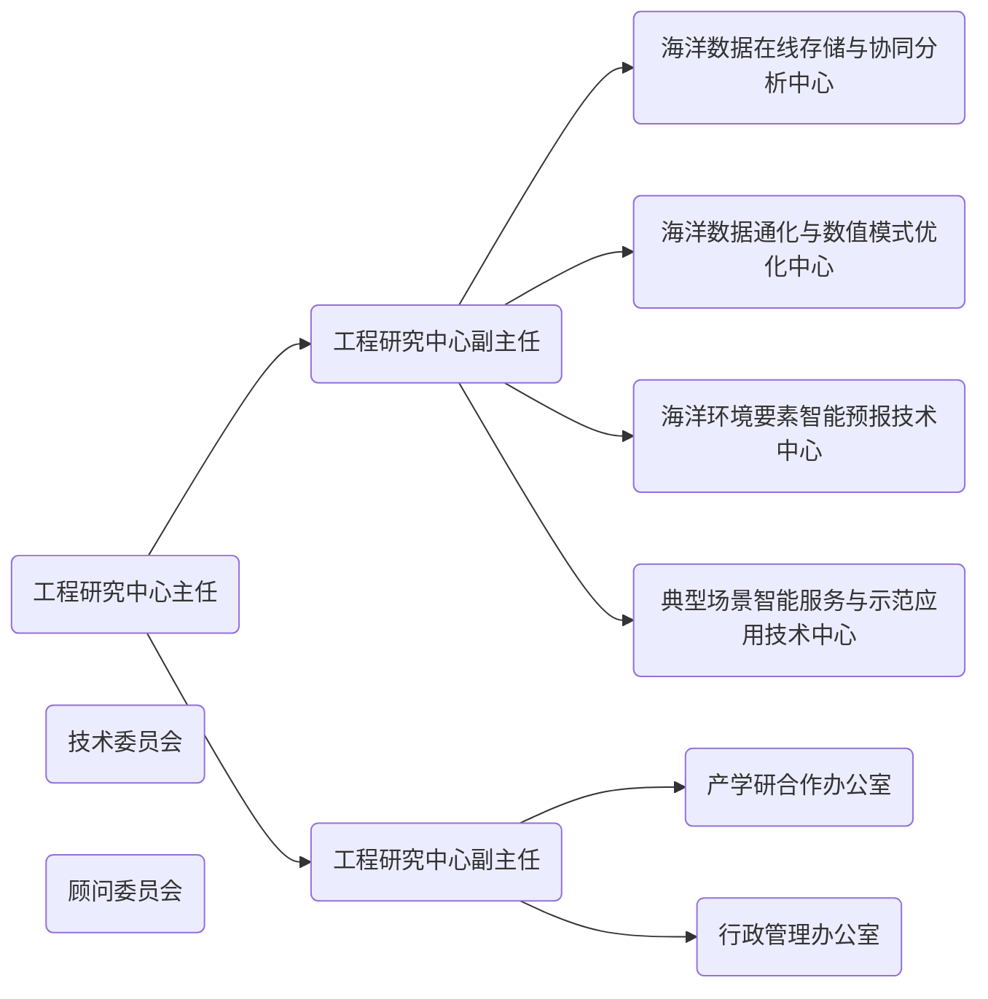

```mermaid
flowchart LR
    C["工程研究中心副主任"] -- <br> --> D["海洋数据在线存储与协同分析中心"] & E["海洋数据通化与数值模式优化中心"] & F["海洋环境要素智能预报技术中心"]
    A["工程研究中心副主任"] --> n1["产学研合作办公室"] & n2["行政管理办公室"]
    n3["工程研究中心主任"] --> C & A
    C --> n6["典型场景智能服务与示范应用技术中心"]
    n5["技术委员会"]
    n4["顾问委员会"]

    C@{ shape: rounded}
    D@{ shape: rounded}
    E@{ shape: rounded}
    F@{ shape: rounded}
    A@{ shape: rounded}
    n1@{ shape: rounded}
    n2@{ shape: rounded}
    n3@{ shape: rounded}
    n6@{ shape: rounded}
    n5@{ shape: rounded}
    n4@{ shape: rounded}
```